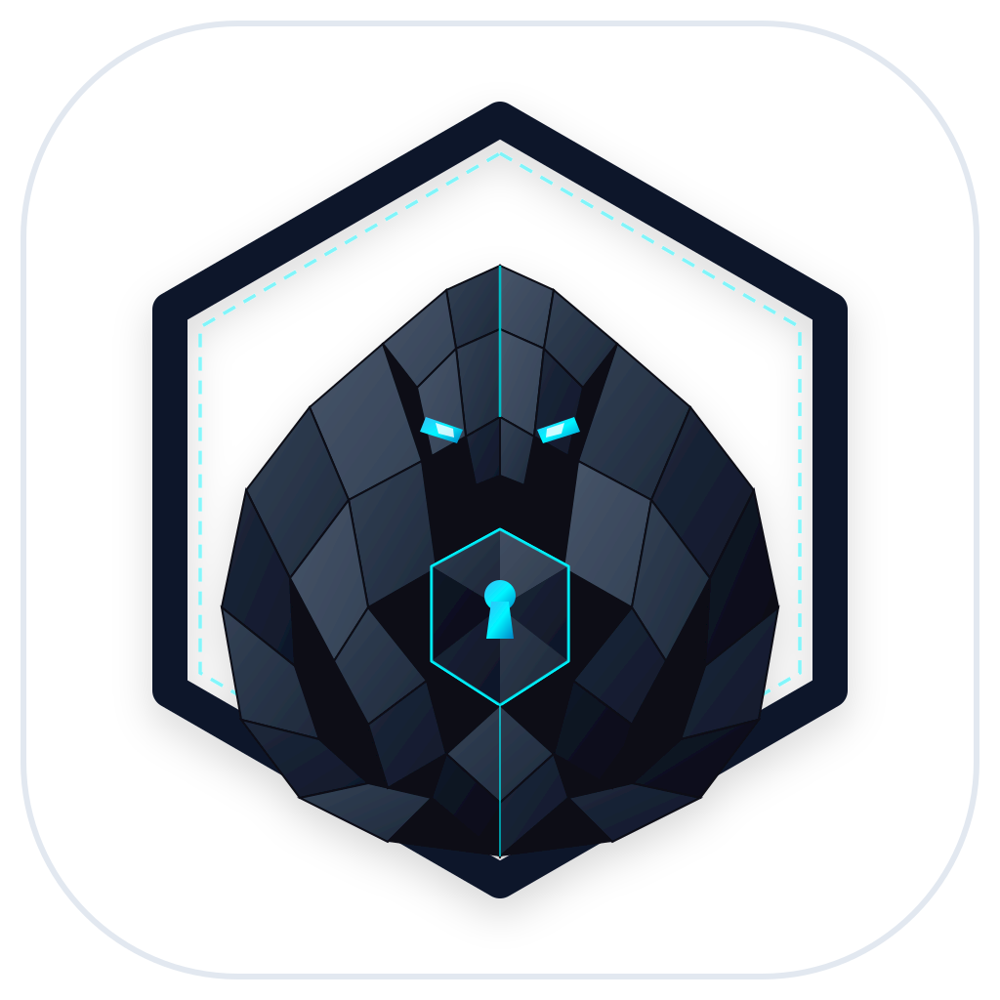

<p align="center">
  
</p>

<h1 align="center">VaultCloud TMA</h1>

<p align="center">
  <strong>Zero-knowledge encrypted personal cloud drive Telegram Mini App backed by Telegram's free, unlimited 2GB file storage.</strong>
</p>

<p align="center">
  <a href="#application-demo"></a>
  <a href="LICENSE"></a>
  <a href="https://www.typescriptlang.org/"></a>
  <a href="https://fastify.dev/"></a>
  <a href="https://react.dev/"></a>
</p>

---

## Overview

Telegram provides unlimited cloud file storage with single file uploads up to 2GB. However, files sit in unorganized chat histories where Telegram servers can read them in plaintext.

VaultCloud TMA transforms Telegram into a private encrypted cloud drive with folder trees, instant search, and client-side encryption. Files are split into 10MB chunks and encrypted with AES-GCM-256 inside the browser before ever leaving the device. The relay server and Telegram see only encrypted binary blobs.

<p align="center" id="application-demo">
  
</p>

---

## Mascot: Aegis Pangolin

<p align="center">
  
</p>

The official mascot of VaultCloud TMA is the **Aegis Pangolin ("The Armored Vault Guardian")**.

The pangolin embodies natural biological encryption. When facing threats, it curls into a sphere of overlapping, impenetrable keratin armor scales. In the exact same manner, VaultCloud protects user data by segmenting large files into 10MB interlocking encrypted chunks guarded by client-side WebCrypto keys.

---

## Interface Preview

### 1. Drive Interface & Folder Hierarchy
The primary drive workspace provides folder navigation, breadcrumb paths, search filters, and real-time storage metrics.

<p align="center">
  
</p>

### 2. In-Vault Encrypted Markdown Notes
Write and edit sensitive notes directly in the drive. Notes encrypt on the fly with AES-GCM-256 before uploading to Telegram.

<p align="center">
  
</p>

### 3. In-Memory Decrypted Document Viewer
Files decrypt directly into memory using WebCrypto and temporary object URLs. Nothing gets written to local unencrypted storage.

<p align="center">
  
</p>

### 4. Storage Analytics & Quota Breakdown
Real-time breakdown of stored assets across documents, media, images, and archives alongside Telegram's unlimited storage capacity.

<p align="center">
  
</p>

### 5. Quick PIN Lock & Inactivity Timeout
Configure a 4-digit PIN for rapid session access and set automatic timeout rules that purge encryption keys from browser memory when idle.

<p align="center">
  
</p>

### 6. Multi-File Batch Actions & Decrypted ZIP Export
Select multiple files simultaneously to star, move, trash, or compress into a single in-memory ZIP package.

<p align="center">
  
</p>

### 7. Zero-Knowledge Vault Authentication
Unlocks the client cryptographic engine using PBKDF2 key derivation with 100,000 SHA-256 rounds. Passphrases never leave device RAM.

<p align="center">
  
</p>

---

## Core Features

- Client-side AES-GCM-256 encryption via the standard WebCrypto API
- Master key derivation with PBKDF2 (100,000 rounds, SHA-256, and random salt)
- Virtual file system with nested folders, search, breadcrumbs, favorites, and trash bin
- Automatic 10MB chunking to handle multi-gigabyte uploads over Telegram Bot API
- In-memory media preview for photos, audio, videos, and PDFs without saving decrypted files to disk
- Standalone execution with Long Polling and a built-in demo mode requiring zero external domains
- Telegram Mini App integration with automatic theme matching and haptic feedback
- Docker support with multi-stage builds and compose files

## Advanced Features

- Zero-Knowledge Link Sharing: Share individual encrypted files using URL hash fragments (`#share=...&key=...`). Browsers never transmit hash fragments over HTTP, ensuring relays and servers cannot read shared keys.
- Client-Side Encrypted Photo Thumbnails: Images generate 140x140 WebP thumbnails resized and encrypted in the browser for high-speed grid browsing without downloading full multi-megabyte image assets.
- Telegram Chat Inbox Drop: Users can forward documents or photos straight to the Telegram bot chat. The files are stored in an Inbox queue and can be vaulted with full client-side encryption in one tap.
- Multi-File Batch Actions & In-Memory ZIP: Multi-select files to star, move, trash, or package into an in-memory decrypted ZIP archive using JSZip.
- In-Vault Encrypted Markdown Notes: Create and edit secure text or Markdown notes in place without external editor dependencies.
- Quick PIN Lock & Auto-Lock Timer: Set an optional 4-digit PIN for quick unlocks and configure inactivity timeouts that purge cryptographic keys from memory when idle.
- Full Vault Export: Download a disaster recovery ZIP package containing all decrypted files and a structured JSON metadata manifest.

## Architecture

```
[Browser / Mini App]
    | 1. Slices file into 10MB chunks
    | 2. Encrypts with AES-GCM-256 using PBKDF2 derived key
    v
[Fastify Server]
    | 3. Stores folder structure and chunk manifests in SQLite
    | 4. Streams encrypted chunks to storage adapter
    v
[Telegram API / Mock Storage]
    | 5. Saves chunks as encrypted document blobs
```

For more details, see [docs/ARCHITECTURE.md](docs/ARCHITECTURE.md) and [docs/SECURITY.md](docs/SECURITY.md).

## Quick Start

### 1. Requirements
- Node.js 20 or higher
- npm 10 or higher

### 2. Installation
```bash
git clone https://github.com/alexandrmotologa/vaultcloud-tma.git
cd vaultcloud-tma
npm install
```

### 3. Run in Demo Mode
Copy the example environment file:
```bash
cp .env.example .env
```

Build the web frontend and start the relay server:
```bash
npm run build
npm start
```

Open `http://localhost:8080` in your browser. Use the demo passphrase `DemoPassword123!` to unlock the sample vault.

## Project Structure

```
vaultcloud-tma/
├── docs/                     # Architecture, security, API, deployment guides, and UI media
│   └── images/               # Official branding logo, screenshots, and demo GIF
├── server/                   # Fastify backend, SQLite VFS, and grammY Telegram bot
│   ├── src/
│   │   ├── bot/              # Telegram bot commands and long polling
│   │   ├── db/               # SQLite database and virtual file system
│   │   ├── routes/           # REST endpoints for VFS and chunk streams
│   │   ├── security/         # Telegram WebApp initData validator
│   │   └── storage/          # Telegram Bot API relay and mock storage adapter
│   └── package.json
├── web/                      # React 19 Telegram Mini App frontend
│   ├── src/
│   │   ├── components/       # Explorer, preview modals, upload queue, headers
│   │   ├── crypto/           # WebCrypto PBKDF2 and AES-GCM chunking pipelines
│   │   ├── hooks/            # Telegram SDK and drive state management
│   │   └── styles/           # Tailwind CSS styles and theme variables
│   └── package.json
├── docker-compose.yml
├── Dockerfile
└── README.md
```

## Security Guarantees

- Zero-Knowledge: Plaintext files and master passphrases never leave the client browser.
- Authenticated Encryption: Every chunk includes a unique 12-byte IV and an authentication tag that prevents unauthorized tampering.
- Memory-Only Decryption: Media and document previews are rendered using temporary in-memory object URLs that are revoked when closed.
- Open Source: Complete transparency with standard cryptographic algorithms.

## Documentation

- [Architecture Guide](docs/ARCHITECTURE.md)
- [Security Model](docs/SECURITY.md)
- [REST API Reference](docs/API.md)
- [Deployment and Setup Guide](docs/DEPLOYMENT.md)
- [Contributing Guidelines](CONTRIBUTING.md)

## License

Released under the [MIT License](LICENSE).